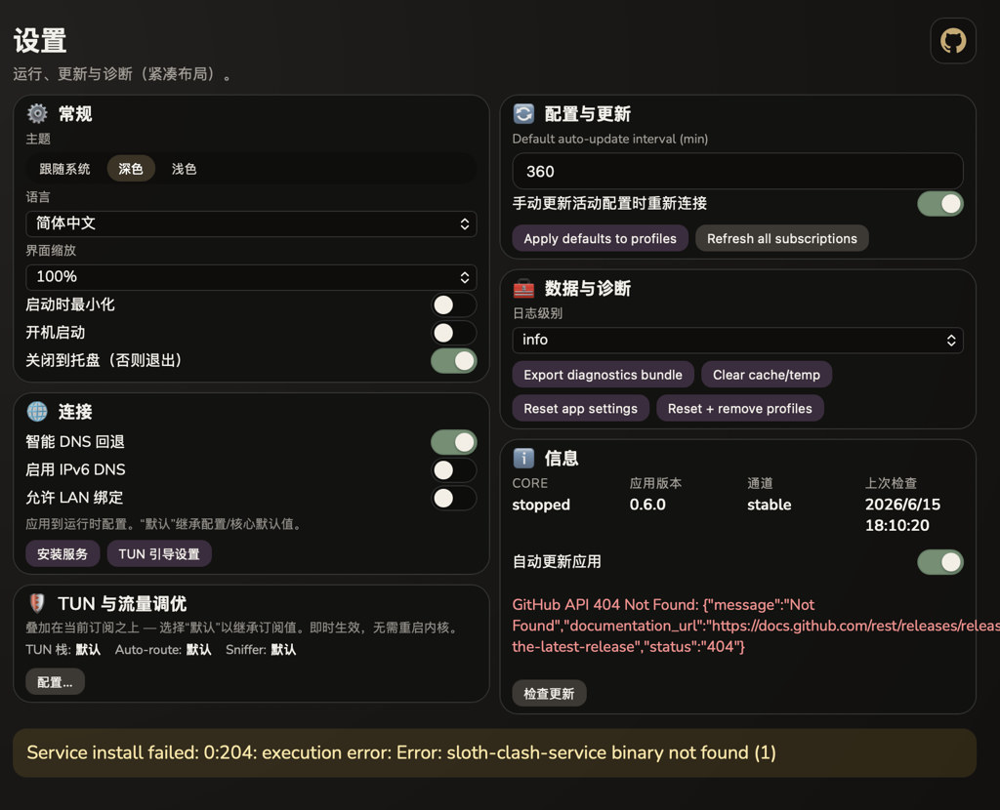

<h1 align="center">
  
</h1>

<p align="center">
  <b>Clash Meta (Mihomo)</b> desktop client — <b>Wails · Go · React</b><br />
  Windows · macOS · Linux
</p>

<p align="center">
  <a href="./docs/README_ru.md">Русский</a> ·
  <a href="./docs/README_zh.md">简体中文</a>
  ·
  <a href="./Changelog.md">Changelog</a>
  ·
  <a href="#support-the-project">Support</a>
</p>

<p align="center">
  
</p>

---

## Overview

Arch Clash is a **GPL-3.0** GUI around **Mihomo** (Clash Meta). This repository ships the **Wails** desktop shell (`apps/arch-clash-desktop`). The Windows **system service / IPC** layer lives in a separate project: [arch-clash-service-ipc](https://github.com/Nemu-x/arch-clash-service-ipc) (release artifacts are consumed by `pnpm run prebuild`).

## Features (high level)

- Profiles, proxies, rules, and merge / script-style config workflows in the UI  
- Mihomo core integration (stable channel via prebuild)  
- One-click **Proxy** / **TUN** traffic modes with a live connection-health status  
- Visual + YAML rule editor, live connections monitor, and a diagnostics/advanced panel  
- Signed, fail-closed **in-app updates** (Windows) with UAC-elevated installer hand-off  
- Windows service installer bundle + sidecar layout compatible with Wails packaging  
- Deep link scheme `archclash://` (see `wails.json`)

## Screenshots

<table>
  <tr>
    <td width="50%"><br /><sub><b>Home</b> — connect, Rule/Global mode, Proxy/TUN traffic, live health & speed</sub></td>
    <td width="50%"><br /><sub><b>Profiles</b> — import & manage subscriptions, usage, auto-update</sub></td>
  </tr>
  <tr>
    <td width="50%"><br /><sub><b>Proxies</b> — selector / url-test groups with latency and search</sub></td>
    <td width="50%"><br /><sub><b>Connections</b> — live per-process traffic, matched rule, up/down</sub></td>
  </tr>
  <tr>
    <td width="50%"><br /><sub><b>Rules</b> — full routing table with type / policy filters</sub></td>
    <td width="50%"><br /><sub><b>Edit rules</b> — visual builder + Advanced (YAML), subscription read-only base</sub></td>
  </tr>
  <tr>
    <td width="50%"><br /><sub><b>Advanced</b> — diagnostics, connectivity probes, recovery tools</sub></td>
    <td width="50%"><br /><sub><b>Settings</b> — theme, language, connection, updates & diagnostics</sub></td>
  </tr>
</table>

## Downloads

Releases for **this app**: [ArchClash releases](https://github.com/Nemu-x/ArchClash/releases) (when published).  
Service binaries used at build time: [arch-clash-service-ipc releases](https://github.com/Nemu-x/arch-clash-service-ipc/releases).

## Build (local)

Prerequisites: **Go 1.25+**, **Node 20+**, **pnpm**, Wails v2 (`go run github.com/wailsapp/wails/v2/cmd/wails@latest` works without a global install).

```bash
pnpm install
pnpm run desktop:resources   # mihomo sidecar, geo DBs, Arch service exes, Windows icon → build/
pnpm run wails:dev           # or: pnpm run wails:build
```

`desktop:resources` writes under `apps/arch-clash-desktop/build/` (ignored by git). On Windows, **`pnpm run icons:windows`** is included there and refreshes **`build/windows/icon.ico`** from `build/appicon.png` so installers / shortcuts pick up the right icon.

## CI

GitHub Actions: `.github/workflows/desktop-artifacts.yml` (Windows, Linux, macOS arm64 + Release) and `.github/workflows/desktop-artifacts-darwin-amd64.yml` (macOS Intel — same tag, adds zip to the same Release).

## Security

Arch Clash ships **fail-closed, cryptographically verified updates**: the in-app updater verifies a **minisign (ed25519)** signature over `SHA256SUMS` against a public key embedded in the binary, then checks the installer's SHA-256 before launching — anything unsigned or tampered is refused (see [docs/UPDATES.md](./docs/UPDATES.md)). CI runs `govulncheck` + `pnpm audit` on every change, the mihomo core is pinned for reproducible builds, and the project is GPL-3.0 / fully auditable. The privileged helper that manages the core/TUN requires a one-time elevation to install, then runs without further prompts.

To report a vulnerability, see [SECURITY.md](./SECURITY.md) (use GitHub private vulnerability reporting — please don't open public issues for security bugs).

## Contributing

See [CONTRIBUTING.md](./CONTRIBUTING.md).

## Support the project

Arch Clash is free and **GPL-3.0**. If it's useful to you, a crypto donation helps keep development and releases going. Thank you! 🦥

| Asset | Address |
| --- | --- |
| **USDT** (TRC20) | `TPACN1kJRm2FnFF1cSqYtBnJwAmZ3qGMni` |
| **USDT** (Polygon / MATIC) | `0xD9333e859Fb74D885d22E27568589de61E4433b5` |
| **BTC** | `bc1qkkcgpqym967k2x73al6f7fpvkx52q4rzkut3we` |
| **ETH** | `0xD9333e859Fb74D885d22E27568589de61E4433b5` |

> Double-check the network before sending — wrong-network transfers are unrecoverable.

## Acknowledgements

- **Basis (upstream GUI this work descends from):** [clash-verge-rev](https://github.com/clash-verge-rev/clash-verge-rev) — Clash Verge Rev (Tauri); Arch Clash reimplements the product direction with **Wails + Go** in this repo.
- **Proxy core (Clash Meta):** [MetaCubeX/mihomo](https://github.com/MetaCubeX/mihomo).
- **Desktop shell:** [Wails](https://github.com/wailsapp/wails) — Go backend + web frontend in one binary.

Also: [zzzgydi/clash-verge](https://github.com/zzzgydi/clash-verge) (original Clash Verge), and the wider Clash ecosystem.

## License

[GPL-3.0](./LICENSE)
