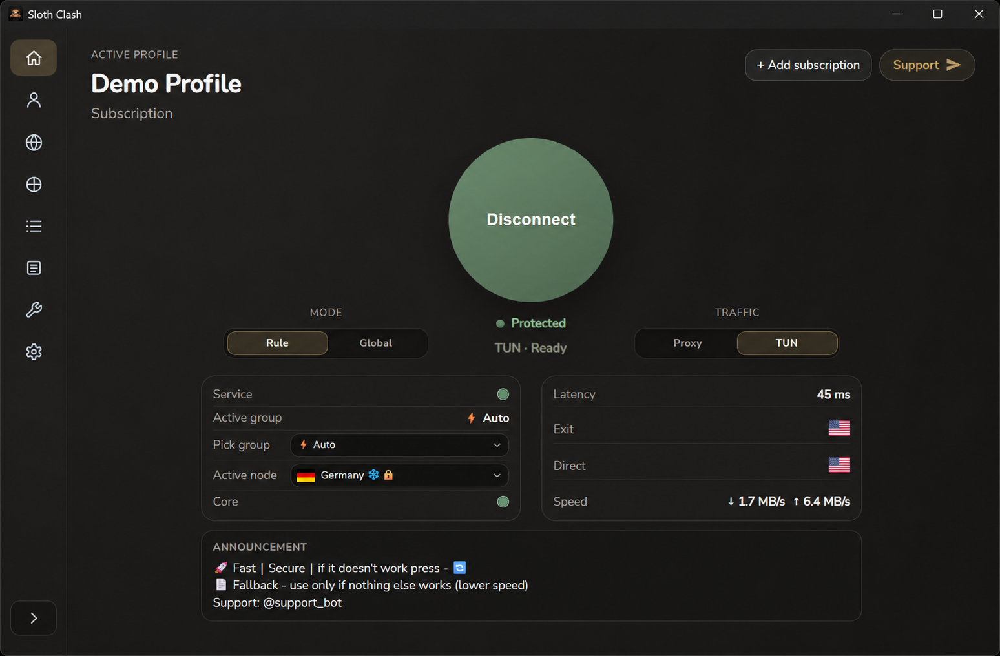
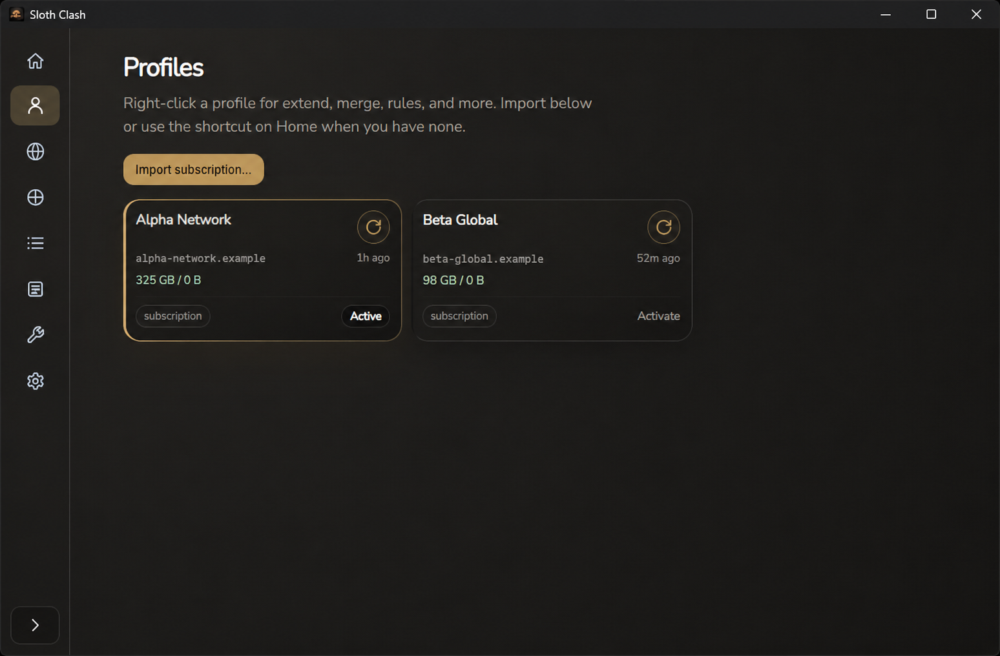
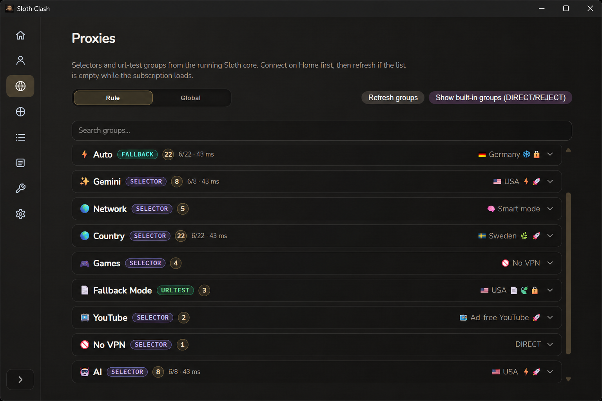
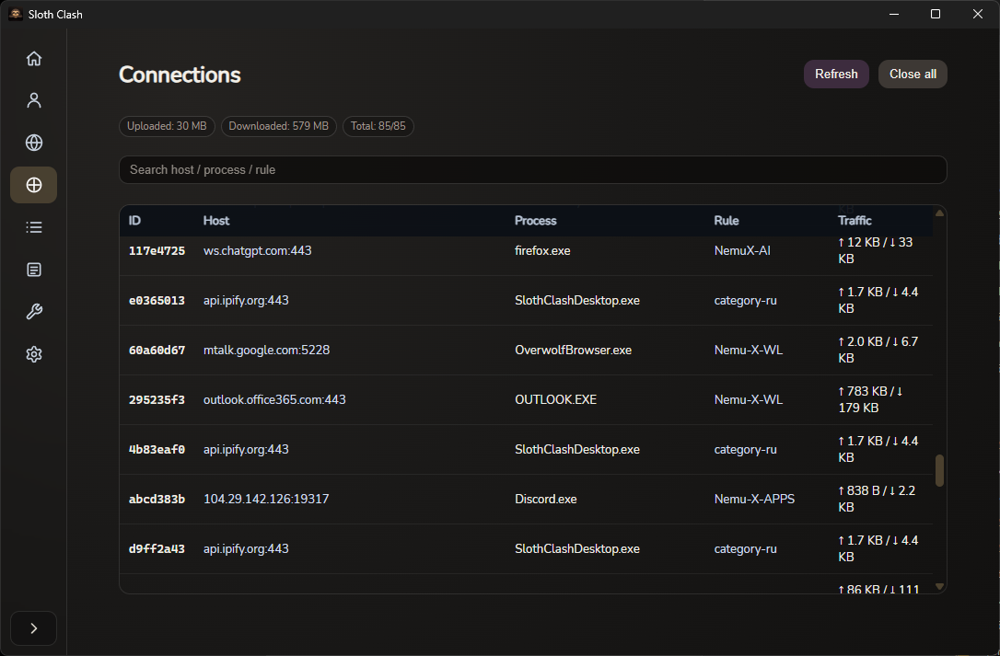
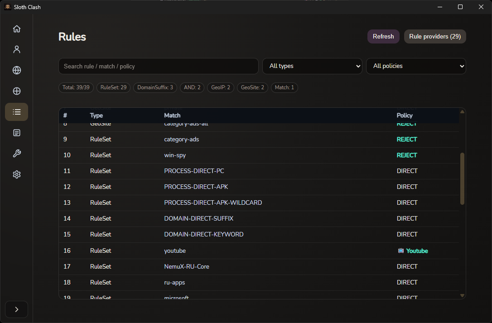
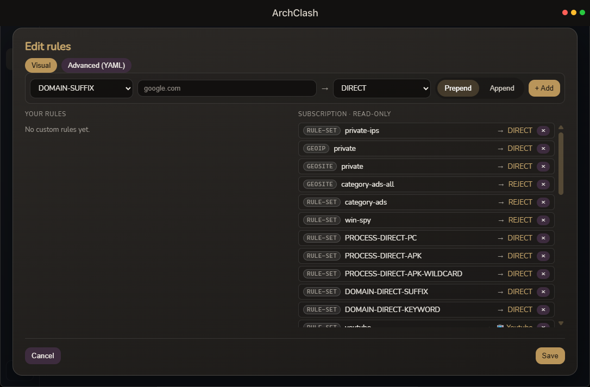
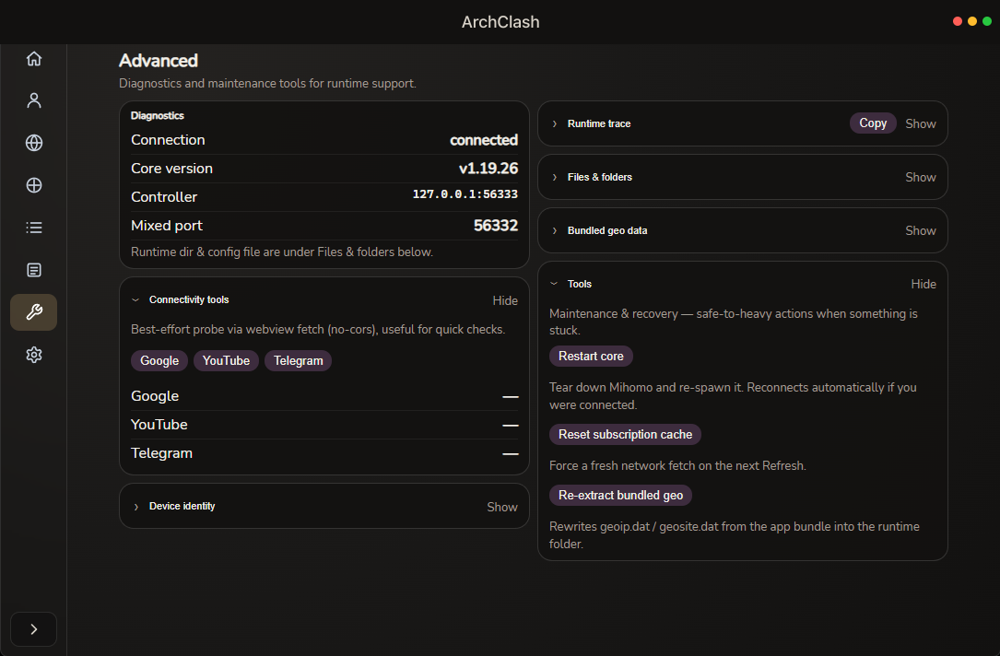
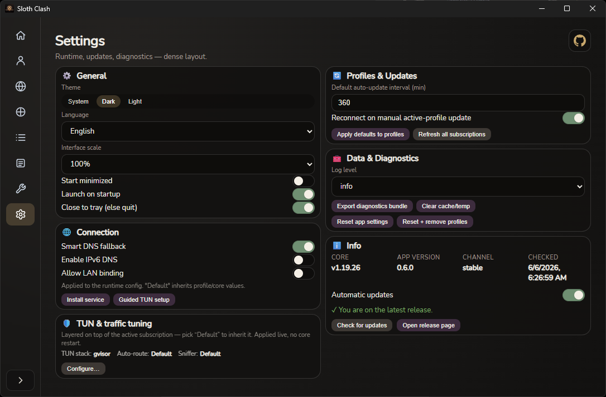

<h1 align="center">
  
  <br />
  Arch Clash
  <br />
</h1>

<p align="center">
  <b>Clash Meta (Mihomo)</b> — десктоп-клиент на <b>Wails · Go · React</b><br />
  Windows · macOS · Linux
</p>

<p align="center">
  <a href="../README.md">English</a> ·
  <a href="./README_en.md">English (docs)</a> ·
  <a href="./README_ru.md">Русский</a> ·
  <a href="./README_zh.md">简体中文</a>
  ·
  <a href="../Changelog.md">Changelog</a>
</p>

<p align="center"><sub>Полный английский текст — в корне: <a href="../README.md"><code>README.md</code></a>.</sub></p>

---

## Обзор

**Arch Clash** — GUI под **GPL-3.0** вокруг **Mihomo** (Clash Meta). В этом репозитории — оболочка **Wails** (`apps/arch-clash-desktop`). Слой **системного сервиса / IPC** для Windows вынесен в отдельный проект: [arch-clash-service-ipc](https://github.com/Nemu-x/arch-clash-service-ipc) (артефакты релизов подтягивает `pnpm run prebuild`).

## Возможности (кратко)

- Профили, прокси, правила и сценарии merge / скриптов в интерфейсе  
- Встраивание ядра Mihomo (stable и опционально alpha через prebuild)  
- Режимы трафика **Proxy** / **TUN** в один клик с живым статусом подключения  
- Визуальный + YAML редактор правил, монитор соединений и панель диагностики  
- Подписанные, fail-closed **встроенные обновления** (Windows) с запуском установщика через UAC  
- Установщик сервиса Windows и раскладка sidecar под упаковку Wails  
- Схема deep link `archclash://` (см. `wails.json`)

## Скриншоты

<table>
  <tr>
    <td width="50%"><br /><sub><b>Главная</b> — подключение, режим Rule/Global, трафик Proxy/TUN, статус и скорость</sub></td>
    <td width="50%"><br /><sub><b>Профили</b> — импорт и управление подписками, трафик, авто-обновление</sub></td>
  </tr>
  <tr>
    <td width="50%"><br /><sub><b>Прокси</b> — группы selector / url-test с задержкой и поиском</sub></td>
    <td width="50%"><br /><sub><b>Соединения</b> — живой трафик по процессам, правило, отдача/приём</sub></td>
  </tr>
  <tr>
    <td width="50%"><br /><sub><b>Правила</b> — полная таблица маршрутизации с фильтрами по типу/политике</sub></td>
    <td width="50%"><br /><sub><b>Редактор правил</b> — визуальный режим + Advanced (YAML), база подписки read-only</sub></td>
  </tr>
  <tr>
    <td width="50%"><br /><sub><b>Дополнительно</b> — диагностика, проверки связи, инструменты восстановления</sub></td>
    <td width="50%"><br /><sub><b>Настройки</b> — тема, язык, подключение, обновления и диагностика</sub></td>
  </tr>
</table>

## Сборки

Релизы приложения: [ArchClash releases](https://github.com/Nemu-x/ArchClash/releases).  
Бинарники сервиса для сборки: [arch-clash-service-ipc releases](https://github.com/Nemu-x/arch-clash-service-ipc/releases).

## Сборка локально

Нужны: **Go 1.25+**, **Node 20+**, **pnpm**, Wails v2.

```bash
pnpm install
pnpm run desktop:resources
pnpm run wails:dev
```

Каталог `desktop:resources`: `apps/arch-clash-desktop/build/` (в git не входит). На Windows в цепочку входит **`pnpm run icons:windows`** — обновляет **`build/windows/icon.ico`** из `build/appicon.png`.

## CI

GitHub Actions: `.github/workflows/desktop-artifacts.yml` — матрица по тегу `v*` или ручной запуск.

## Участие

См. [CONTRIBUTING.md](../CONTRIBUTING.md).

## Поддержать проект

Arch Clash бесплатен и распространяется под **GPL-3.0**. Если он вам полезен — крипто-донат помогает продолжать разработку и выпускать релизы. Спасибо! 🦥

| Актив | Адрес |
| --- | --- |
| **USDT** (TRC20) | `TPACN1kJRm2FnFF1cSqYtBnJwAmZ3qGMni` |
| **USDT** (Polygon / MATIC) | `0xD9333e859Fb74D885d22E27568589de61E4433b5` |
| **BTC** | `bc1qkkcgpqym967k2x73al6f7fpvkx52q4rzkut3we` |
| **ETH** | `0xD9333e859Fb74D885d22E27568589de61E4433b5` |

> Проверьте сеть перед отправкой — перевод в неверной сети вернуть нельзя.

## Благодарности

- **База (откуда выросла концепция GUI):** [clash-verge-rev](https://github.com/clash-verge-rev/clash-verge-rev) — Clash Verge Rev (Tauri); в этом репозитории продукт перенесён на **Wails + Go**.
- **Ядро прокси (Clash Meta):** [MetaCubeX/mihomo](https://github.com/MetaCubeX/mihomo).
- **Десктопная оболочка:** [Wails](https://github.com/wailsapp/wails).

Также: [zzzgydi/clash-verge](https://github.com/zzzgydi/clash-verge) (оригинальный Clash Verge) и экосистема Clash.

## Лицензия

[GPL-3.0](../LICENSE)
